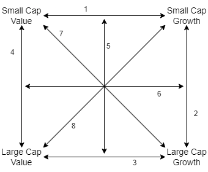
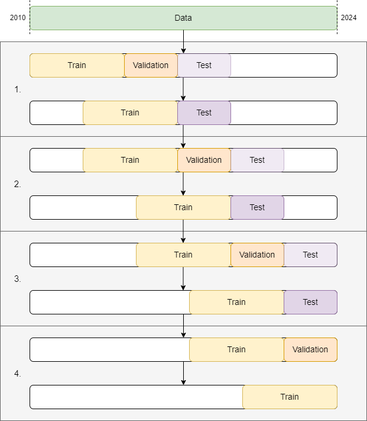

# French Fama Factors
Analysing the predictability of factor outperformance of the French-Fama Five Factor model, based on historical observations and economic data from the St. Louis Federal Reserve, sentiment data from AAII and historical market valuations from Barclays indices.

## Model encyclopedia
The figure below provides an overview of eight comparison models related to the value vs. growth and small vs. large factors.
Each model is a comparison model on one of the eight axes of the graph. All models are trained on weekly data.
A meta-model is trained to predict which of the four corners of the market is most likely to perform best in the near term.
Folders are created for the logs, figures and scripts for each respective models.

The models are named as follows: 
1. HML
2. SMBG
3. HMLL
4. SMB
5. SMBF
6. HMLF
7. SVLG
8. SGLV

## Train- test structure
Because time series data is used, a rolling validation set is used to find the best configuration and hyperparameters.
After the best hyperparameters have been found on the validation set, the model is retrained, and the period immediately following is used as test set.
This is similar to how a model trained on current data would be used to forecast the future. 
To avoid overfitting to the test set, the hyperparameters are not optimized for the test set. 
Instead the test set is used just once to provide an estimate of out-of-sample performance.
An overview of the train/validation/test structure can be found below. 
As can be seen, it consists of several phases, each consisting of two parts; 
the optimization run, where the validation set is used, and the test run where out-of-sample performance is measured.

